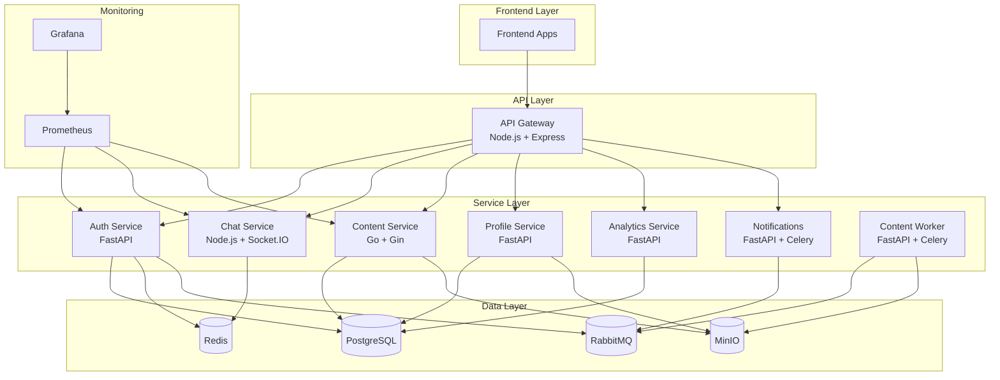

# 🛠️ Technology Stack Overview

Detailed explanation of technologies used in the AI Project and why they were chosen.

## 📊 Architecture Summary



## 🏗️ Core Services

### 🔐 Auth Service (FastAPI + Python)

**Purpose**: Authentication, authorization, and user management

**Why FastAPI?**
- ⚡ **High Performance**: Async/await support, faster than Django/Flask
- 📝 **Auto Documentation**: OpenAPI/Swagger docs generated automatically
- 🔍 **Type Safety**: Pydantic models with validation
- 🛡️ **Security**: Built-in OAuth2, JWT, rate limiting support

**Key Features**:
```python
# Example: Type-safe request/response models
class UserRegisterRequest(BaseModel):
    email: EmailStr
    password: str = Field(min_length=8, max_length=100)

@router.post("/register", response_model=UserResponse)
async def register(request: UserRegisterRequest):
    # Auto-validation, auto-docs, type hints
    pass
```

**Dependencies**:
- **SQLAlchemy**: ORM for database operations
- **Alembic**: Database migrations
- **bcrypt**: Password hashing
- **PyJWT**: JWT token handling
- **Redis**: Session storage and rate limiting

---

### 🌐 API Gateway (Node.js + Express)

**Purpose**: Request routing, rate limiting, authentication middleware

**Why Node.js?**
- 🚀 **Event Loop**: Perfect for I/O-heavy routing operations
- 🔌 **Middleware Ecosystem**: Rich Express.js middleware
- 📦 **NPM Ecosystem**: Vast library selection
- 🔄 **Real-time**: Easy WebSocket proxy for chat service

**Key Features**:
```javascript
// Example: Smart routing with middleware
app.use('/api/auth', authRateLimit, proxy('http://auth-service:8000'));
app.use('/api/chat', wsProxy('http://chat-service:8001'));

// Rate limiting per service
const authRateLimit = rateLimit({
  windowMs: 15 * 60 * 1000, // 15 minutes
  max: 5, // 5 requests per window
  keyGenerator: (req) => req.ip + ':auth'
});
```

**Dependencies**:
- **Express**: Web framework
- **http-proxy-middleware**: Service proxying
- **express-rate-limit**: Rate limiting
- **helmet**: Security headers
- **cors**: Cross-origin resource sharing

---

### 💬 Chat Service (Node.js + Socket.IO)

**Purpose**: Real-time messaging, presence, chat rooms

**Why Node.js + Socket.IO?**
- ⚡ **Real-time**: WebSocket support with fallbacks
- 🔄 **Event-driven**: Perfect for chat message handling
- 📡 **Broadcasting**: Efficient message distribution
- 🏠 **Room Management**: Built-in room/namespace support

**Key Features**:
```javascript
// Example: Real-time message handling
io.on('connection', (socket) => {
  socket.on('join_room', (roomId) => {
    socket.join(roomId);
    socket.to(roomId).emit('user_joined', socket.userId);
  });
  
  socket.on('message', async (data) => {
    // Rate limiting, moderation, persistence
    const message = await processMessage(data);
    io.to(data.roomId).emit('message', message);
  });
});
```

**Dependencies**:
- **Socket.IO**: Real-time communication
- **Redis**: Message persistence and pub/sub
- **TypeScript**: Type safety for large codebase
- **Jest**: Testing framework

---

### 📁 Content Service (Go + Gin)

**Purpose**: File management, content delivery, metadata storage

**Why Go?**
- 🚀 **Performance**: Compiled language, excellent for file I/O
- 🔄 **Concurrency**: Goroutines perfect for file processing
- 💾 **Memory Efficient**: Low memory footprint for file operations
- 🛡️ **Type Safety**: Strong typing without runtime overhead

**Key Features**:
```go
// Example: Concurrent file processing
func (s *ContentService) ProcessUpload(file *multipart.FileHeader) error {
    // Parallel processing
    errChan := make(chan error, 3)
    
    go func() { errChan <- s.validateFile(file) }()
    go func() { errChan <- s.scanVirus(file) }()
    go func() { errChan <- s.generateThumbnail(file) }()
    
    // Wait for all operations
    for i := 0; i < 3; i++ {
        if err := <-errChan; err != nil {
            return err
        }
    }
    return s.saveToStorage(file)
}
```

**Dependencies**:
- **Gin**: Fast HTTP framework
- **GORM**: ORM for Go
- **MinIO Client**: Object storage client
- **go-migrate**: Database migrations

---

### 👤 Profile Service (FastAPI + Python)

**Purpose**: User profiles, preferences, avatar management

**Why FastAPI?** (Same as Auth Service)
- Consistency with auth service
- Excellent for CRUD operations
- Built-in validation for profile data

**Key Features**:
```python
# Example: Profile with file upload
@router.put("/avatar")
async def update_avatar(
    file: UploadFile = File(...),
    current_user: User = Depends(get_current_user)
):
    # Validate image, resize, upload to MinIO
    avatar_url = await process_avatar(file, current_user.id)
    await update_user_avatar(current_user.id, avatar_url)
    return {"avatar_url": avatar_url}
```

---

### 📊 Analytics Service (FastAPI + Python)

**Purpose**: Event tracking, analytics, reporting

**Why FastAPI?**
- **Async Processing**: Handle high-volume events
- **Batch Operations**: Efficient data processing
- **Integration**: Easy integration with data science tools

**Key Features**:
```python
# Example: Event ingestion with batching
@router.post("/events/batch")
async def ingest_events(events: List[AnalyticsEvent]):
    # Batch process events
    async with database.transaction():
        await analytics_repo.bulk_insert(events)
    
    # Trigger async processing
    await queue.enqueue("process_analytics", events)
```

---

### 📢 Notifications Service (FastAPI + Celery)

**Purpose**: Email, SMS, push notifications

**Why FastAPI + Celery?**
- **Async Tasks**: Background email/SMS processing
- **Reliability**: Task retry and failure handling
- **Scalability**: Distributed task processing

**Key Features**:
```python
# Example: Async notification processing
@celery_app.task(bind=True, max_retries=3)
def send_email_task(self, email_data):
    try:
        email_service.send_email(**email_data)
    except SMTPException as exc:
        # Exponential backoff retry
        self.retry(countdown=60 * (2 ** self.request.retries))
```

---

## 🗄️ Data Storage

### 🐘 PostgreSQL

**Purpose**: Primary relational database

**Why PostgreSQL?**
- 🔒 **ACID Compliance**: Data consistency and reliability
- 🔍 **Advanced Features**: JSON support, full-text search, arrays
- 📈 **Scalability**: Excellent performance for complex queries
- 🛡️ **Security**: Row-level security, encryption
- 🔧 **Extensions**: PostGIS for location data, pg_stat_statements for monitoring

**Schema Design**:
```sql
-- Example: User table with advanced features
CREATE TABLE users (
    id UUID PRIMARY KEY DEFAULT gen_random_uuid(),
    email VARCHAR(255) UNIQUE NOT NULL,
    password_hash VARCHAR(255) NOT NULL,
    profile_data JSONB DEFAULT '{}',
    preferences JSONB DEFAULT '{}',
    created_at TIMESTAMPTZ DEFAULT NOW(),
    updated_at TIMESTAMPTZ DEFAULT NOW(),
    
    -- Full-text search
    search_vector tsvector GENERATED ALWAYS AS (
        to_tsvector('english', email || ' ' || (profile_data->>'name'))
    ) STORED
);

-- Index for fast searches
CREATE INDEX idx_users_search ON users USING GIN(search_vector);
```

---

### ⚡ Redis

**Purpose**: Caching, sessions, rate limiting, pub/sub

**Why Redis?**
- 🚀 **In-Memory Speed**: Sub-millisecond response times
- 🔄 **Data Structures**: Lists, sets, hashes, sorted sets
- 📡 **Pub/Sub**: Real-time messaging support
- 💾 **Persistence**: Optional disk persistence
- 🔧 **Atomic Operations**: Race-condition-free counters

**Usage Patterns**:
```python
# Example: Rate limiting with Redis
def check_rate_limit(user_id: str, limit: int, window: int) -> bool:
    key = f"rate_limit:{user_id}"
    pipe = redis.pipeline()
    
    # Sliding window counter
    pipe.zremrangebyscore(key, 0, time.time() - window)
    pipe.zcard(key)
    pipe.zadd(key, {str(uuid4()): time.time()})
    pipe.expire(key, window)
    
    results = pipe.execute()
    return results[1] < limit
```

---

### 🐰 RabbitMQ

**Purpose**: Message queuing, event-driven architecture

**Why RabbitMQ?**
- 🔒 **Reliability**: Message persistence and acknowledgments
- 🔄 **Routing**: Complex message routing patterns
- 📊 **Management**: Excellent monitoring and management UI
- 🛡️ **Security**: Authentication, authorization, SSL/TLS
- 📈 **Scalability**: Clustering and federation support

**Message Patterns**:
```python
# Example: Event-driven user registration
# Publisher (Auth Service)
def emit_user_registered(user_email: str):
    message = {
        "event": "user.registered",
        "data": {"email": user_email, "timestamp": datetime.utcnow()},
        "trace_id": str(uuid4())
    }
    
    channel.basic_publish(
        exchange="user.events",
        routing_key="user.registered",
        body=json.dumps(message),
        properties=pika.BasicProperties(delivery_mode=2)  # Persistent
    )

# Consumer (Notifications Service)
def handle_user_registered(ch, method, properties, body):
    data = json.loads(body)
    send_welcome_email(data["data"]["email"])
    ch.basic_ack(delivery_tag=method.delivery_tag)
```

---

### 📦 MinIO

**Purpose**: Object storage for files, images, videos

**Why MinIO?**
- 🔗 **S3 Compatible**: Same API as AWS S3
- 🚀 **High Performance**: Optimized for modern hardware
- 🔒 **Security**: Encryption at rest and in transit
- 📊 **Multi-tenancy**: Bucket policies and user management
- 💰 **Cost Effective**: No vendor lock-in, self-hosted

**Usage Patterns**:
```go
// Example: Secure file upload with policies
func (s *StorageService) UploadUserFile(userID string, file io.Reader) (string, error) {
    bucketName := fmt.Sprintf("user-%s", userID)
    
    // Create user-specific bucket with policy
    policy := fmt.Sprintf(`{
        "Version": "2012-10-17",
        "Statement": [{
            "Effect": "Allow",
            "Principal": {"AWS": ["arn:aws:iam::%s:user/*"]},
            "Action": "s3:GetObject",
            "Resource": "arn:aws:s3:::%s/*"
        }]
    }`, userID, bucketName)
    
    return s.client.PutObject(context.Background(), bucketName, objectName, file, -1)
}
```

---

## 📊 Monitoring & Observability

### 📈 Prometheus

**Purpose**: Metrics collection and alerting

**Why Prometheus?**
- 🎯 **Pull Model**: Services expose metrics, Prometheus scrapes
- 📊 **Time Series**: Perfect for monitoring metrics over time
- 🔍 **PromQL**: Powerful query language for metrics
- 🚨 **Alerting**: Built-in alerting rules and notifications
- 🔧 **Service Discovery**: Automatic target discovery

**Custom Metrics**:
```python
# Example: Custom business metrics
from prometheus_client import Counter, Histogram, Gauge

# Counters
user_registrations = Counter('user_registrations_total', 'Total user registrations')
email_sent = Counter('emails_sent_total', 'Total emails sent', ['type'])

# Histograms for latency
request_duration = Histogram('request_duration_seconds', 'Request duration')

# Gauges for current state
active_users = Gauge('active_users_current', 'Currently active users')

# Usage
@request_duration.time()
def process_registration(email: str):
    user_registrations.inc()
    # ... registration logic ...
    email_sent.labels(type='welcome').inc()
```

---

### 📊 Grafana

**Purpose**: Visualization and dashboards

**Why Grafana?**
- 📊 **Rich Visualizations**: Multiple chart types and panels
- 🔗 **Data Source Integration**: Prometheus, PostgreSQL, Redis
- 🚨 **Alerting**: Visual alerts and notifications
- 👥 **Multi-tenancy**: Team and permission management
- 🎨 **Customizable**: Extensive theming and branding options

**Dashboard Examples**:
```json
{
  "dashboard": {
    "title": "AI Project Overview",
    "panels": [
      {
        "title": "Request Rate",
        "type": "graph",
        "targets": [
          {
            "expr": "rate(http_requests_total[5m])",
            "legendFormat": "{{service}} - {{method}}"
          }
        ]
      },
      {
        "title": "Error Rate",
        "type": "singlestat",
        "targets": [
          {
            "expr": "rate(http_requests_total{status=~\"5..\"}[5m]) / rate(http_requests_total[5m])"
          }
        ]
      }
    ]
  }
}
```

---

## 🔧 Development Tools

### 📦 Docker & Docker Compose

**Purpose**: Containerization and local development

**Benefits**:
- 🔄 **Consistency**: Same environment across dev/staging/prod
- 🚀 **Quick Setup**: One command to start entire stack
- 🔒 **Isolation**: Services don't interfere with each other
- 📈 **Scalability**: Easy to scale services independently

### ☸️ Kubernetes

**Purpose**: Container orchestration in production

**Benefits**:
- 🔄 **Auto-scaling**: Scale based on CPU/memory/custom metrics
- 🛡️ **Self-healing**: Automatic restart of failed containers
- 🔄 **Rolling Updates**: Zero-downtime deployments
- 🌐 **Service Discovery**: Built-in load balancing and networking
- 📊 **Resource Management**: CPU/memory limits and requests

### 🎯 Helm

**Purpose**: Kubernetes package management

**Benefits**:
- 📦 **Templating**: Reusable Kubernetes manifests
- 🔧 **Configuration**: Environment-specific values
- 🔄 **Rollbacks**: Easy rollback to previous versions
- 📈 **Upgrades**: Smooth application updates

---

## 🏆 Technology Decision Matrix

| Requirement | Technology | Alternatives Considered | Why Chosen |
|-------------|------------|------------------------|------------|
| **API Framework** | FastAPI | Django REST, Flask | Performance + auto-docs + type safety |
| **Real-time Communication** | Socket.IO | WebSockets, Server-Sent Events | Browser compatibility + fallbacks |
| **File Processing** | Go | Node.js, Python | Performance for I/O operations |
| **Database** | PostgreSQL | MySQL, MongoDB | ACID compliance + JSON support |
| **Cache/Session** | Redis | Memcached, In-memory | Data structures + pub/sub |
| **Message Queue** | RabbitMQ | Apache Kafka, Redis Pub/Sub | Reliability + management UI |
| **Object Storage** | MinIO | AWS S3, Google Cloud Storage | S3 compatibility + self-hosted |
| **Monitoring** | Prometheus + Grafana | ELK Stack, DataDog | Open source + pull model |
| **Containerization** | Docker | Podman, LXC | Industry standard + ecosystem |
| **Orchestration** | Kubernetes | Docker Swarm, Nomad | Feature completeness + community |

---

## 🚀 Performance Characteristics

### Service Response Times (Target)
- **Auth Service**: < 100ms for login/register
- **Chat Service**: < 50ms for message delivery
- **Content Service**: < 500ms for file upload (< 10MB)
- **Profile Service**: < 200ms for profile updates
- **Analytics Service**: < 1s for report generation

### Scalability Targets
- **Concurrent Users**: 10,000+ active users
- **Messages/sec**: 1,000+ chat messages
- **File Uploads**: 100+ concurrent uploads
- **API Requests**: 10,000+ requests/minute

### Resource Usage (Per Service)
- **CPU**: 100-500m (0.1-0.5 cores)
- **Memory**: 256MB-1GB depending on service
- **Storage**: Stateless services, data in external stores

---

This technology stack provides a solid foundation for a scalable, maintainable, and performant AI E-Learning platform. Each technology was chosen for specific strengths that align with the service requirements and overall system architecture.
